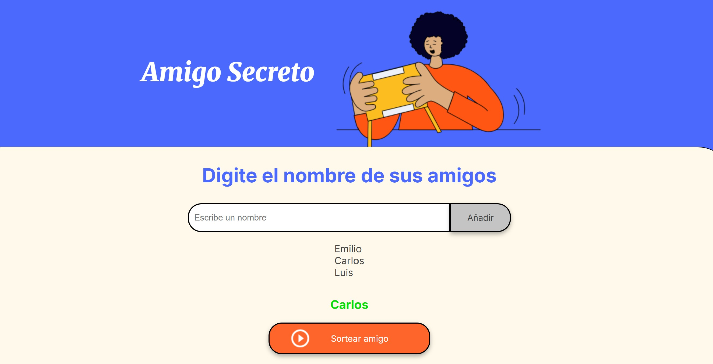

# Desatio Amigo Secreto

## Índice
- [Amigo Secreto](#amigo-secreto)
- [Características](#características)
- [Uso](#uso)
- [Tecnologías](#tecnologías)
- [Contribución](#contribución)
- [Licencia](#licencia)

## Aplicación web para gestionar un sorteo de "amigo secreto". Solo tienes que escribir los nombres de tus amigos y esta app sorteará un nombre al azar. 

## Características

- **Agregar nombres**: Ingresa el nombre de un amigo y haz clic en "Adicionar".
- **Validación**: Si el campo está vacío, muestra una alerta.
- **Visualización**: Muestra en pantalla la lista de nombres agregados.
- **Sorteo aleatorio**: Selecciona un nombre al azar al hacer clic en "Sortear Amigo".

## Uso

1. Clona el repositorio.
2. Abre `index.html` en tu navegador.
3. Agrega los nombres y realiza el sorteo.

## Tecnologías

- HTML
- CSS
- JavaScript

## Contribución

Las contribuciones son bienvenidas. Para sugerir mejoras, abre un issue o envía un pull request.

## Licencia

Este proyecto se distribuye bajo la licencia MIT.

<h4 align="center">
:construction: Proyecto en construcción :construction:
</h4>

